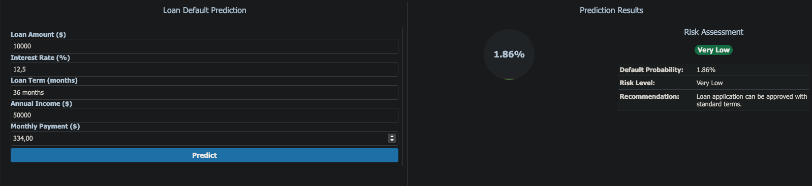
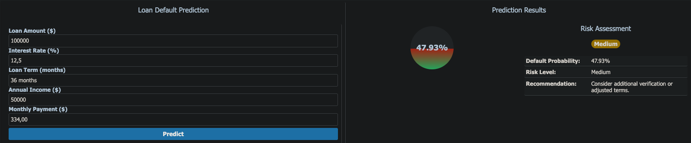

# MyProject_DataScienceInFinance

# Loan Default Prediction Analysis

## Executive Summary
This analysis aims to predict loan defaults using machine learning techniques. The dataset contains information about loan applications and their outcomes. We'll explore the data, engineer features, and build a predictive model to identify potential default cases.

## Key Objectives:
1. Data Exploration and Cleaning
2. Feature Engineering and Selection
3. Model Development and Evaluation
4. Risk Assessment and Business Impact Analysis

## Application Interface
Below are screenshots of the application interface:

